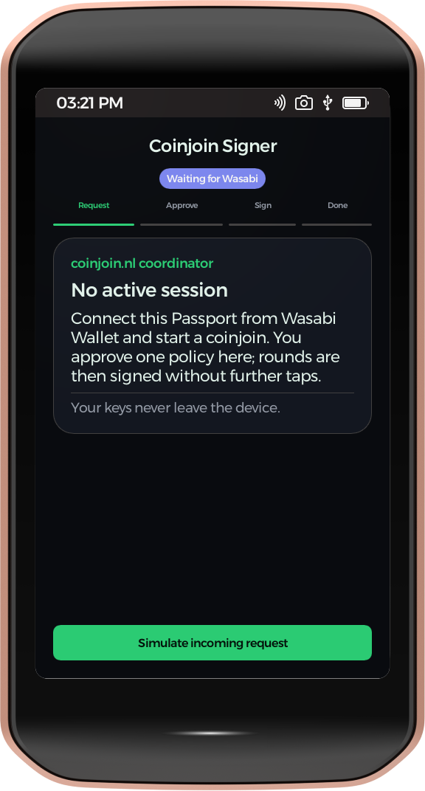
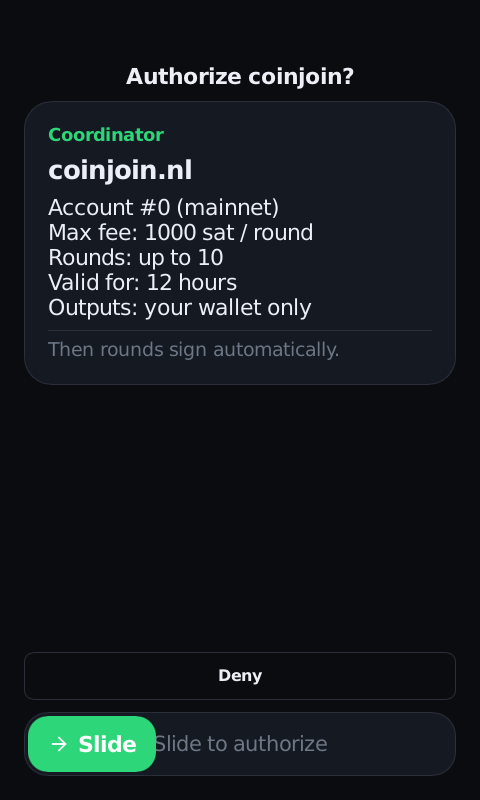
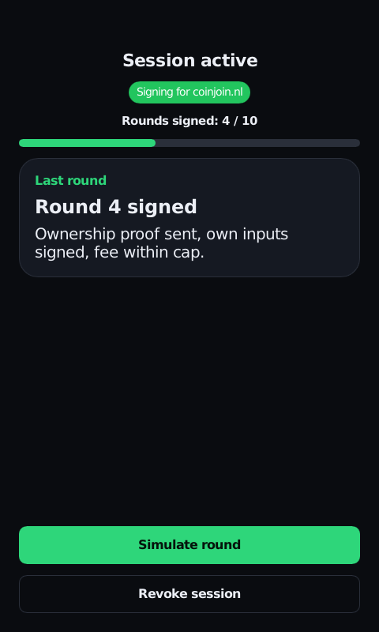
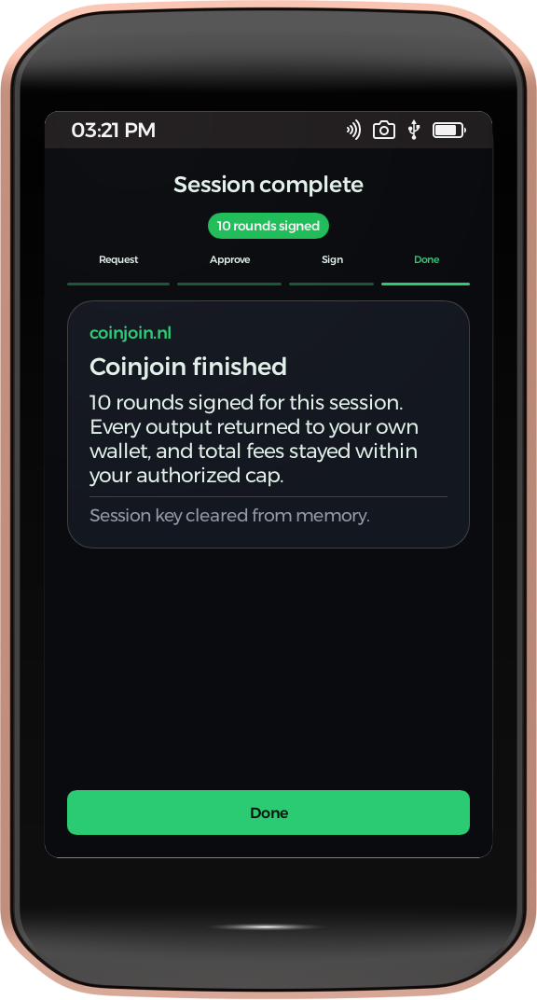

# Coinjoin Signer — Passport Prime app

A KeyOS SDK app: the on-device UI for using Passport Prime as an unattended
WabiSabi coinjoin signer for Wasabi Wallet. **The signing logic is real** — the
app links the [`wallet-rpc-core`](crates/wallet-rpc-core) engine (the same
policy/session/SLIP-0019 code as the KeyOS
[`feature/passport-coinjoin`](https://github.com/kravens/KeyOS/tree/feature/passport-coinjoin)
branch, 45 unit tests): slide-to-authorize reads the device seed once, derives
and caches the account keys, and every round produces a real taproot SLIP-0019
ownership proof, policy-checked against the coordinator binding. Dark-first,
matching Wasabi.

**Runs on a retail Passport Prime** (KeyOS 1.4.0+) as a sideloaded third-party
app. Built against Foundation SDK 1.0.0.

## Screens

| Home | Authorize | Session | Complete |
|---|---|---|---|
|  |  |  |  |

1. **Home** — idle, "Waiting for Wasabi".
2. **Authorize** — the one human approval: coordinator, account, session fee
   budget, round limit, 12-hour expiry, then slide-to-authorize.
3. **Session active** — live round counter; each test round runs the real
   engine (taproot SLIP-0019 proof for the next index, coordinator-bound
   commitment) and shows the result; revoke closes the session and zeroizes keys.
4. **Complete** — session summary.

## Install on a Passport Prime (KeyOS 1.4.0 or newer)

No developer mode or USB debugging needed. From `dist/` (or your own
`foundation pack` output), copy these two files to a USB drive or the Airlock
volume:

- `coinjoin-nl-publisher.crt` — the publisher certificate
- `coinjoin-signer.app` — the signed app bundle

Then on the device:

1. **Settings > Apps > Allowed Publishers** → add → pick the `.crt`. Compare the
   full fingerprint shown with the one below before choosing Allow.
2. **Settings > Apps > Install App** → pick `coinjoin-signer.app`.
3. Launch **Coinjoin** from the launcher. On the first authorize the device asks
   once to allow the app-scoped seed; choose Allow Always.
4. **Settings > Apps > Coinjoin Signer > App Hash** must equal the app hash of
   the release you installed (below).

Publisher `coinjoin.nl`, fingerprint (SHA-256 of the compressed secp256k1 key):

```
66ae2850019a16b2eef6a006425e22b6559e2a9b4af939a086e3ef5fef86f61f
```

App hash of `dist/coinjoin-signer.app` v0.2.0 (SHA-256 of `app.elf` without the
2048-byte signature header):

```
d75c1ef6a7b1db7dd000df447e3e0c27d8adb8933d295e0d0fad9b5903c8d3e7
```

Verify locally: `tar -xOf coinjoin-signer.app app.elf | tail -c +2049 | sha256sum`.

## Wallet model

Third-party apps on KeyOS never see the master seed (`GetSeed` is reserved for
Foundation-signed apps). The signer uses `GetAppSeed`: a per-app 32-byte seed
derived by KeyOS as `hmac256(app_id, master_seed)`. So the coinjoin wallet is a
**separate wallet** from the main Passport bitcoin wallet, rooted in the same
backup: restoring the master seed on another Passport reproduces it. Wasabi
imports this wallet's account xpub (BIP-86 `m/86'/0'/0'`, fingerprint shown on
the Session screen) and coins are sent into it for coinjoining.

## What is still gated by Foundation

KeyOS 1.4 gives third-party apps no host channel: QuantumLink's wallet-sync
messages and the USB vendor interface (`os/usbdev`) are Foundation-signed-only,
and Bluetooth is QuantumLink-only. So the *request* is still local: "Simulate
incoming request" fills the same pending-policy slot a Wasabi message will, and
everything after it is the real engine. Binding a transport changes only where
the policy bytes come from. The message set is proposed in
[`COINJOIN_PROPOSAL.md`](https://github.com/kravens/KeyOS/blob/feature/passport-coinjoin/os/wallet-rpc/COINJOIN_PROPOSAL.md).

## Build (Foundation SDK 1.0.0)

Needs Nix and the SDK (`curl -sSfL https://sdk.foundation.xyz/latest/install.sh | bash`).
The project references the SDK through the `.foundation-sdk/current` symlink
that `foundation new`/`build` maintain, so clone and build:

```sh
nix develop ~/.foundation/sdk/current --command bash
foundation doctor
foundation cert gen coinjoin.nl --publisher-name coinjoin.nl \
  --contact-email hello@coinjoin.nl --support-url https://coinjoin.nl/   # once
foundation build            # signed armv7 bundle, prints the app hash
foundation sim              # hosted simulator
foundation pack --release   # target/keyos/coinjoin-signer.app
foundation cert fingerprint ~/.foundation/signing/coinjoin.nl/certificate.crt
```

Engine tests (the CLI stages `@ui` and the theme under `target/foundation`, so
plain cargo needs the paths):

```sh
FOUNDATION_UI_LIBRARY_PATH=$PWD/target/foundation/ui/ui \
FOUNDATION_THEMES_SLINT_DIR=$PWD/target/foundation/themes/slint \
FOUNDATION_THEMES_RUST_DIR=$PWD/target/foundation/themes/rust \
  cargo test -p wallet-rpc-core
```

`.cargo/config.toml` sets `CC_armv7a_unknown_xous_elf=arm-none-eabi-gcc` for
`secp256k1-sys`. The buttons use a small local `ui/cjbutton.slint` so the
preview viewer paints them without the theme pipeline.

## License

This app is [MIT](LICENSE.md), matching Wasabi Wallet. The engine
`crates/wallet-rpc-core` is dual-licensed **`MIT OR GPL-3.0-or-later`** so it
merges cleanly into the GPLv3 KeyOS tree when contributed upstream.
